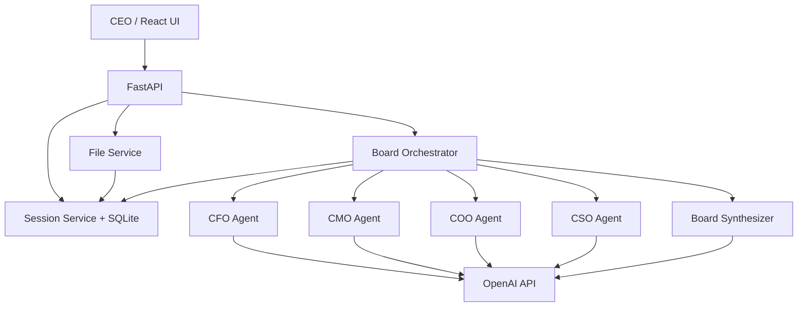

# AI Boardroom / Boardroom in a Box

A hiring-assignment prototype where a CEO convenes a virtual C-suite — **CFO, CMO, COO, and CSO** — to debate a business question in multiple rounds, ground advice in uploaded company data, and produce a final **Board Recommendation**.

This is intentionally **not** a single generic chatbot. Distinct executive personas analyze the same situation through different lenses, see each other's opinions, and may disagree before a synthesizer integrates the discussion.

---

## 1. Project overview

**AI Boardroom** helps a CEO:

1. Create a persistent boardroom session
2. Optionally upload CSV/JSON company metrics
3. Ask a business question
4. Watch a structured multi-agent discussion (2 rounds)
5. Read a board synthesis (recommendation, risks, disagreements, actions, metrics, confidence)
6. Continue the conversation in the same session

---

## 2. Architecture

Backend

backend/

FastAPI
SQLAlchemy
SQLite
OpenAI SDK
pandas for structured CSV processing
Pydantic
pytest
Frontend

frontend/

React
Create React App
Executive boardroom dashboard
Data

data/

Fictional/demo company metrics
Example CSV data for local demonstrations

## 3. Why Multiple Agents?

A single LLM prompt can easily produce a generic recommendation that averages competing business considerations.

This project instead gives each executive a distinct mandate.

For example:

CFO may prioritize profitability, margins, cash, ROI, and financial risk.
CMO may prioritize growth, CAC, retention, LTV, brand, and market share.
COO may prioritize capacity, throughput, cost-to-serve, and execution feasibility.
CSO may prioritize competitive positioning, strategic durability, and long-term trade-offs.

The goal is not to force disagreement. Executives can agree when the evidence supports the same conclusion, but their reasoning should remain grounded in their respective functional perspectives.

## 4. Executive Personas

Role	Persona	Primary Focus
CEO	Ananya Kapoor	Human decision-maker who asks business questions and reviews the board recommendation
CFO	Arjun Mehta	P&L, margin, cash, ROI, working capital, financial risk
CMO	Riya Sharma	Growth, brand, CAC, demand, retention, LTV, market share
COO	Vikram Nair	Capacity, throughput, efficiency, delivery, operational risk
CSO	Aditya Iyer	Competitive position, market structure, strategic durability, long-term trade-offs

Persona definitions and prompts are maintained under:

backend/app/agents/

## 5. Multi-Agent Discussion Flow

Each CEO question is processed as an independent board decision cycle.

Step 1 — CEO Question

The CEO submits a business question such as:

Revenue, market share, and customer count have all increased, while operating margin and CAC have also improved. Should the company accelerate growth next period, or focus on consolidating profitability?

Step 2 — Question Analysis

The backend analyzes the current question to determine:

Question intent
Relevant business dimensions
Metrics required to answer the question
Missing metrics that should be disclosed rather than fabricated

Only metrics relevant to the current question are selected from the uploaded company data.

Step 3 — Round 1: Independent Views

Each executive independently analyzes the question using:

The current question
Relevant uploaded metrics
Their functional persona
Their own business priorities

They do not receive the previous-question discussion.

Step 4 — Round 2: Cross-Challenge

Each executive receives the current question's Round 1 peer perspectives.

They can:

Challenge another executive
Agree with a valid point
Refine their position
Identify trade-offs
Update their recommendation

Previous questions are not injected into the new analysis.

Step 5 — Board Synthesis

A Board Synthesizer integrates the current discussion into:

Primary recommendation
Key evidence
Key disagreements
Key risks
Recommended actions
Metrics to monitor
Confidence level
Conditions that should change the decision

The final Board Recommendation remains tied to the current question.

## 6. Question Isolation

A key design requirement is that every new CEO question should be treated as a fresh decision cycle.

For each question:

Current Question
      ↓
Question Analysis
      ↓
Relevant Metrics
      ↓
Round 1
      ↓
Round 2
      ↓
Board Synthesis
      ↓
Current Board Recommendation

Previous-question executive responses are stored for session history but are not used as analytical context for the next question.

This prevents state leakage such as:

A marketing question receiving working-capital reasoning from a previous question
A new question inheriting recommendations from an earlier question
Irrelevant metrics appearing because they were used in a previous analysis

The uploaded company data remains persistent, but metric selection is performed based on the current question.

## 7. Data Grounding

The system supports structured company data through CSV/JSON uploads.

The data pipeline:

Receives the uploaded file
Validates file type and size
Parses and normalizes the data
Stores the uploaded dataset for the session
Analyzes the current CEO question
Selects only relevant metrics
Provides those metrics to the executive agents
Uses the current discussion for Board synthesis
Important

The system does not simply inject the entire company dataset into every question.

Instead:

Question → Relevant metrics → Executive analysis

This helps reduce irrelevant evidence and keeps each board discussion focused.

Agents are instructed to:

Use provided figures
Avoid inventing metrics
Distinguish direct evidence from supporting/related evidence
Explicitly disclose when a requested metric is unavailable

For example, if the CEO asks about EBITDA but the uploaded dataset does not contain EBITDA, the system should not infer an EBITDA change from unrelated metrics.

## 8. Persistence

SQLite is used for lightweight prototype persistence.

Main persisted entities include:

sessions
session ID
title
timestamps
messages
speaker
role
content
round
session ID
uploaded_data
filename
raw data
normalized data
session ID

The database file defaults to:

backend/boardroom.db

Persistence is used for session storage and history. Previous-question messages are not fed back into the analytical pipeline for subsequent questions.

## 9. Technology Stack

Backend:-
Python 3.11+
FastAPI
Uvicorn
OpenAI Python SDK
SQLAlchemy 2.x
SQLite
Pydantic
python-dotenv
pandas

Frontend:-
React
Create React App
Testing
pytest
httpx TestClient
Mocked LLM calls for backend tests

## 10. Setup Instructions

Prerequisites
Python 3.11+
Node.js 18+
npm
OpenAI API key only when using real OpenAI mode

The application can also run in Demo Mode without an OpenAI API key.

## 11. Backend Setup

From the project root:

cd backend

Create/activate a virtual environment if needed:

python -m venv venv
.\venv\Scripts\activate

Install dependencies:

pip install -r requirements.txt

Create the environment file:

copy .env.example .env

## 12. Environment Variables

Create:

backend/.env
Demo Mode

Demo Mode does not require an OpenAI API key.

DEMO_MODE=true
OPENAI_API_KEY=
OPENAI_MODEL=gpt-4o-mini

When:

DEMO_MODE=true

the application uses deterministic mock executive responses.

This allows the complete workflow to be demonstrated without external LLM calls or API credits.

CSV/JSON uploads, sessions, question processing, board workflow, and the frontend remain available.

Real OpenAI Mode

To use live LLM responses:

DEMO_MODE=false
OPENAI_API_KEY=sk-...
OPENAI_MODEL=gpt-4o-mini

A valid OpenAI API key and available API credits are required.

Optional Variables
CORS_ORIGINS=http://localhost:3000,http://127.0.0.1:3000
DATABASE_URL=sqlite:///./boardroom.db
MAX_UPLOAD_BYTES=2097152
DISCUSSION_ROUNDS=2
Frontend API URL

Optional:

REACT_APP_API_URL=http://127.0.0.1:8000

If unset, the frontend defaults to:

http://127.0.0.1:8000

Never put the OpenAI API key in the React frontend.

## 13. Running the Backend

From the project root:

cd backend
.\venv\Scripts\activate
python -m uvicorn app.main:app --reload

Backend:

http://127.0.0.1:8000

API documentation:

http://127.0.0.1:8000/docs

Health endpoint:

http://127.0.0.1:8000/health

## 14. Running the Frontend

Open another terminal:

cd frontend
npm install
npm start

The React application will normally be available at:

http://localhost:3000

This project uses Create React App. Use npm start, not npm run dev.

## 15. Example Strategic Question

A representative question for the board is:

Revenue, market share, and customer count have all increased, while operating margin and CAC have also improved. Should the company accelerate growth next period, or focus on consolidating profitability? What should the board decide, and what conditions should determine the decision?

The board can then produce:

CFO perspective
CMO perspective
COO perspective
CSO perspective
Cross-challenges
Board Recommendation
Conditions for accelerating growth
Conditions for consolidating profitability
Risks and monitoring metrics

## 16. Example company data

The repository includes a fictional company KPI dataset used for the prototype:

`data/sample_company_data.csv`

The dataset contains previous-period and current-period business metrics, including:

| Metric | Previous | Current |
|---|---:|---:|
| Operating Margin | 12.0% | 14.0% |
| Gross Margin | 48.2% | 48.0% |
| Revenue | 5.40 | 6.10 |
| Market Share | 14.0% | 18.0% |
| Cost per Acquisition (CAC) | 142.00 | 125.00 |
| Customer Count | 2,850 | 3,200 |
| Lifetime Value (LTV) | 650.00 | 680.00 |
| Days Sales Outstanding (DSO) | 44.00 | 38.00 |
| Capacity Utilization | 70.0% | 76.0% |
| On-Time Delivery | 88.0% | 93.0% |
| Defect Rate | 1.6% | 1.1% |
| Employee Attrition | 13.0% | 11.0% |

The dataset is fictional and is included only to demonstrate data-grounded board discussions.

Upload the CSV through the application before asking questions about company performance.

## 17. Design Decisions

Orchestrator over free-form agent chat

The Board Orchestrator controls:

Question analysis
Metric selection
Round 1
Round 2
Synthesis
Validation

This makes the workflow reproducible and easier to evaluate.

Question-scoped grounding

Rather than sending the complete dataset to every executive for every question, the system identifies metrics relevant to the current question.

This reduces irrelevant evidence and helps prevent generic responses.

Independent Round 1

Executives first form their own views before seeing peer opinions.

This is intended to reduce premature convergence.

Cross-challenge Round 2

Executives then receive peer perspectives and can challenge or refine their views.

This creates a more boardroom-like interaction.

Isolated question sessions

Each new question gets its own analytical cycle.

Previous-question responses may remain available in persistence/history, but they are not used as analytical context for the new question.

SQLite

SQLite provides simple zero-operations persistence suitable for a hiring-assignment prototype.

CSV/JSON grounding

Structured CSV/JSON provides high-signal business metrics without introducing the complexity of a full document RAG pipeline.

LLM isolation

LLM interaction is isolated in the backend AI service layer, making it easier to mock during testing and replace or extend the model provider later.

Create React App

The existing React frontend uses Create React App and was retained to avoid unnecessary framework migration during the assignment.

## 18. Limitations

Real OpenAI mode requires a valid API key and available API credits
Demo Mode uses deterministic mock responses and is intended for demonstration/testing rather than live model quality
Two discussion rounds plus synthesis can require multiple LLM calls in real mode
PDF/document ingestion is not implemented
No authentication or multi-user tenancy
No production-grade role-based access control
LLM output quality depends on the selected model
Structured output parsing and validation are defensive but cannot guarantee perfect model responses
The prototype uses SQLite rather than a production database
No production observability/tracing system is included

## 19. Production Extensions

A production version could extend the prototype with:

Authentication and role-based access control
Multi-tenant company workspaces
PostgreSQL or another production database
Streaming executive responses
Structured model-output validation
Agent evaluation and regression testing
LLM observability and tracing
Cost and latency monitoring
More sophisticated document/data retrieval
Connections to financial, CRM, marketing, and operational systems
Board memo/PDF export
Human approval workflows
Model/provider fallback strategies
Stronger governance and audit trails

A production system would also require systematic evaluation of:

Factual grounding
Metric selection accuracy
Executive persona consistency
Cross-agent reasoning quality
Board recommendation quality
Hallucination rate
Decision consistency across repeated runs

## 20. API Endpoints

Method	Path	Purpose
GET	/health	Health status and LLM mode
GET	/sessions	List sessions
POST	/sessions	Create a session
GET	/sessions/{id}	Get session details
DELETE	/sessions/{id}	Delete a session
GET	/sessions/{id}/messages	Get session message history
POST	/sessions/{id}/message	Run a board discussion
POST	/sessions/{id}/upload	Upload CSV/JSON company data

Interactive API documentation is available at:

http://127.0.0.1:8000/docs

## 21. Testing

From the backend directory:

cd backend
.\venv\Scripts\activate
python -m pytest -q

LLM calls are mocked during tests, so the test suite does not require a real OpenAI API key.

The test suite includes validation around:

Question-specific metric selection
Question isolation
Sequential questions without cross-contamination
Missing requested metrics
Working-capital metric selection
Round 2 context isolation
Frontend build validation

## 22. Demo Script for Evaluators

A quick demonstration can follow these steps:

1. Start the backend
cd backend
.\venv\Scripts\activate
python -m uvicorn app.main:app --reload
2. Start the frontend
cd frontend
npm start
3. Use Demo Mode

Set:

DEMO_MODE=true

No OpenAI API key is required.

4. Create a boardroom session

Create a new session from the React UI.

5. Upload company data

Upload:

data/sample_company_data.csv
6. Ask a strategic question

For example:

Revenue, market share, and customer count have all increased, while operating margin and CAC have also improved. Should the company accelerate growth next period, or focus on consolidating profitability?

7. Observe the board discussion

The UI should show:

CFO — financial perspective
CMO — growth/customer perspective
COO — operational perspective
CSO — strategy perspective
Round 2 cross-challenge
Board Recommendation

8. Ask another question

For example:

Is our working-capital efficiency improving or deteriorating compared with the previous period, and what should the CFO recommend?

The new question should produce a fresh analysis using only metrics relevant to that question.

Previous-question reasoning should not leak into the new board discussion.

## 23. Repository Structure

AI_Powered_Virtual_CXO_Board/
│
├── backend/
│   ├── app/
│   │   ├── agents/
│   │   ├── services/
│   │   └── ...
│   ├── tests/
│   ├── requirements.txt
│   └── ...
│
├── frontend/
│   ├── src/
│   ├── public/
│   ├── package.json
│   └── ...
│
├── data/
│   └── sample_company_data.csv
│
├── README.md
├── DESIGN.md
└── ...

## 24. Project Status

This repository contains a working hiring-assignment prototype demonstrating a multi-agent virtual C-suite board.

The focus of the prototype is on:

Specialized executive reasoning
Multi-agent interaction
Data-grounded recommendations
Question isolation
Board-level synthesis
A usable React interface
A runnable FastAPI backend

It is intentionally scoped as a prototype rather than a production enterprise system.
